# EV Fleet Charging Lab

[](https://github.com/tanaymihani/ev-fleet-charging-lab/actions/workflows/ci.yml)

**When, where and how should an electric fleet charge?** This repository answers that with public data in two connected studies:

1. **Charging sessions** — 259k real sessions from the City of Palo Alto's public chargers (2011–2020): plug-in-time prediction with calibrated uncertainty, behavioural segmentation, site congestion, and a quasi-experiment on what happened when the city started charging $0.23/kWh.
2. **Robotaxi fleet** — an event-driven simulator of an electric robotaxi fleet serving **3.08 million real Manhattan taxi trips** (April 2025), with real NYISO wholesale electricity prices and real hourly weather. It compares charging policies, optimizes charger siting with an exact MILP, and stress-tests everything.

Everything runs on a laptop CPU from free data, every number below is produced by a script in [`scripts/`](scripts) and saved in [`reports/results/`](reports/results), and the simulator is checked by invariant tests in CI.

---

## Key results

**Fleet charging (NYC, held-out test week, 10 paired seeds)**

- **Charging *timing* is the lever.** A forecast-driven orchestrator that tops up vehicles in demand troughs and keeps them on the road at peaks serves **96.1 % of riders vs 92.7 %** for the usual "charge at 20 %, stop at 80 %" rule (**+3.4 pp**, 95 % CI +3.0 to +3.8), with a 0.5-minute shorter mean pickup wait and **15 % lower energy cost**. The trade-off is a **16 % higher peak charging load**, because it fills every charger overnight.
- The same gap holds at **full scale**: 745k requests, 2,750 vehicles, 94.0 % → 97.4 % served (≈65 s wall-clock for an 8-day run).
- For a 96 % service level the orchestrator needs **≈545 vehicles instead of ≈609 (−10 %)**.
- With the orchestrator, **24 chargers beat 72 chargers** run with the threshold rule (96.1 % vs 93.4 % served). More infrastructure does not fix bad timing.
- **Ablation:** the gains come from trough charging, unplugging part-charged cars for waiting riders, and a lower charge trigger when cars are scarce. The explicit **price signal adds nothing measurable** in New York, because cheap wholesale hours already coincide with low demand — this may differ on a solar-heavy grid where midday power is cheapest (not tested here).
- **Siting:** an exact p-median layout cuts the mean drive to a charger from 9.1 to 6.5 minutes versus placing chargers in the six busiest zones, and cuts charger-trip distance by 25 %, but barely changes service.

**Charging sessions (Palo Alto)**

- **Prediction at plug-in:** gradient-boosted quantile regression predicts how long a car will stay with a **52-minute MAE**, against 56–73 minutes for three baselines. **80 % conformal (CQR) intervals cover 80.6 %** of held-out sessions.
- **Distribution shift:** under COVID (2020), statically calibrated intervals fall to 73–77 % coverage. **Nightly recalibration on sessions that have already ended** — dwell time is only known once the car leaves — recovers ~80 % coverage from July onwards.
- **Pricing:** introducing $0.23/kWh cut sessions by **29–43 %** and **idle "parking" time per session by 50–65 %**, depending on the design. Sessions that were mostly parking fell **69 %**. The same design run as a placebo on 2016 (no fee) gives estimates between −15 % and +10 %, so these magnitudes carry that much design uncertainty — the direction and scale are robust, the second digit is not.
- **Congestion:** one site (Webster) has every port occupied **20 % of weekday working hours**; most sites never fill. That is where extra ports would help first.

---

## Fleet study: charging a robotaxi fleet in Manhattan

<p align="center">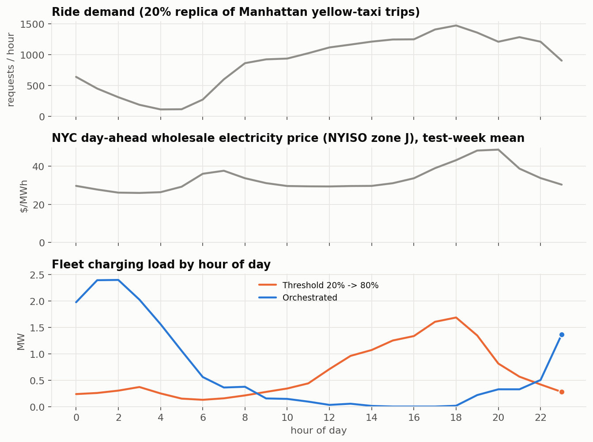</p>

The threshold rule sends cars to charge as soon as they hit 20 %, which happens mostly in the afternoon and evening — exactly when riders and electricity prices peak. The orchestrator moves almost all charging to 23:00–05:00.

### Setup

| | |
|---|---|
| Demand | Every cleaned Manhattan-internal yellow-taxi trip (NYC TLC, April 2025) is a ride request at its real time, origin, destination, duration and distance. Experiments use a 20 % random replica; a full-scale run checks the conclusions. |
| Travel times (empty driving) | Log-additive model *pair effect × weekday/weekend-by-hour congestion*, fit by median polish on 1–21 April. Validated on **952,699 held-out trips: MAE 3.3 min** (3.7 without time of day, 5.1 at constant speed). |
| Vehicles | 40 kWh usable battery; energy = rolling/urban losses + aerodynamic drag + always-on compute + heat-pump HVAC driven by the real hourly temperature (stated assumptions, not telemetry). |
| Charging | 150 kW DC chargers; lithium-ion taper curve (80 → 100 % takes longer than 20 → 80 %); 92 % efficiency; FIFO queues. |
| Prices | NYISO day-ahead zonal LBMP, zone N.Y.C., hourly. |
| Dispatch | Nearest idle car that can reach the rider within 10 minutes *and* has energy for the trip, a drive to a charger and a 5 % reserve; riders wait up to 10 minutes; rebalancing toward forecast demand every 15 minutes (min-cost assignment). |
| Discipline | Policy parameters and the scenario (550 cars, 36 chargers, 6 sites) were fixed on a **validation week** (13–20 April); results are on the **held-out test week** (22–28 April). Seeds give paired, independent demand replicas. |

### Policies compared

| Policy | Rule |
|---|---|
| Threshold 20 → 80 % | Charge below 20 %, nearest charger, stop at 80 %. |
| Threshold 20 → 100 % | Same, but charge to full. |
| Queue-aware | Same trigger; choose the charger with the earliest *predicted plug-in time* given cars charging, queued and en route. |
| **Orchestrated** | Every 5 minutes: forecast next-hour demand, keep an idle buffer, send surplus low-battery cars to free chargers (Hungarian assignment), with a higher top-up ceiling in cheap day-ahead hours; one charger per depot kept for low-battery arrivals; lower trigger when cars are scarce; part-charged cars may be unplugged for waiting riders. |

### Results

<p align="center">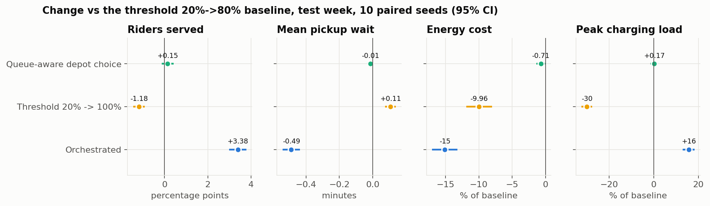</p>

| Test week, 10 seeds | Riders served | Mean pickup wait | Mean charger queue | Energy cost / day | Avg. price paid | Peak charging load |
|---|---:|---:|---:|---:|---:|---:|
| Threshold 20 → 80 % | 92.7 % | 6.89 min | 5.0 min | $538 | $35.6/MWh | 3.12 MW |
| Threshold 20 → 100 % | 91.6 % | 7.00 min | 26.6 min | $485 | $33.9/MWh | 2.19 MW |
| Queue-aware | 92.9 % | 6.88 min | 2.3 min | $535 | $35.3/MWh | 3.13 MW |
| **Orchestrated** | **96.1 %** | **6.40 min** | 17.5 min | **$457** | **$28.8/MWh** | 3.61 MW |

Costs are wholesale energy only, for the 20 % replica. Queue-aware depot choice halves charger queues but its service gain (+0.15 pp) is not distinguishable from zero. Charging to 100 % is worse on service and queues, though its fewer, longer sessions lower the peak.

<table>
<tr>
<td>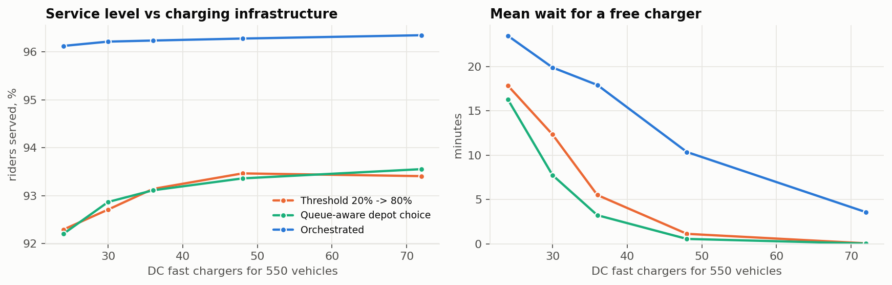</td>
<td>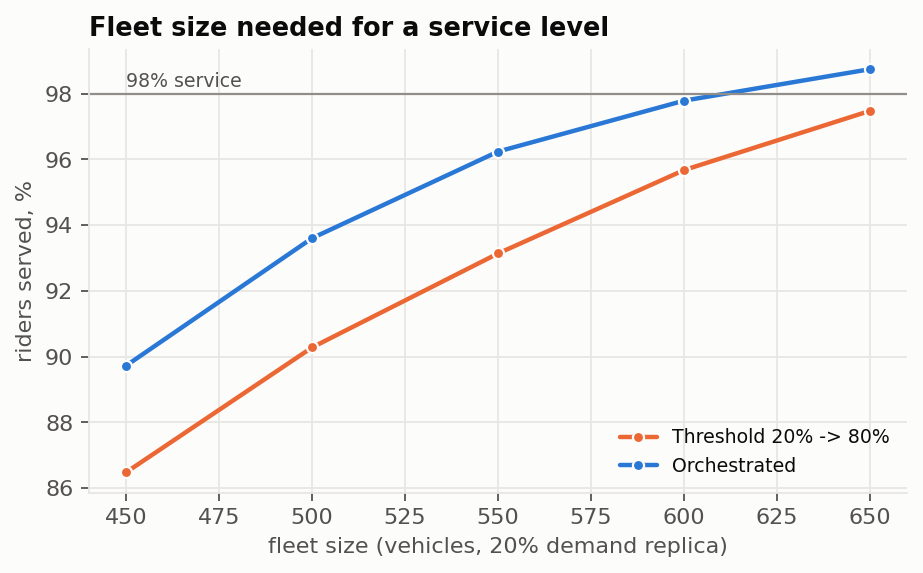</td>
</tr>
</table>

**Ablation — which parts matter** (test week, 6 paired seeds; explains the mechanism, selects nothing):

| Variant | Riders served | Energy cost / day |
|---|---:|---:|
| Threshold 20 → 80 % | 93.0 % | $546 |
| Orchestrated (full) | 96.2 % | $458 |
| − trough top-ups | 95.1 % | $528 |
| − unplug-for-riders (preemption) | 95.8 % | $451 |
| − lower trigger when cars are scarce | 95.9 % | $481 |
| − price signal | 96.1 % | $458 |
| − reserved charger per depot | 96.2 % | $453 |
| top-ups only (no preemption, no scarce trigger) | 94.4 % | $465 |

**Stress tests** (seeds 0–3). The orchestrator keeps its service lead in every scenario. In a week-long −5 °C cold snap, energy use rises sharply for everyone and the orchestrator's cost advantage disappears (≈$924 vs $884 per day) — more charging has to happen in expensive hours.

<p align="center">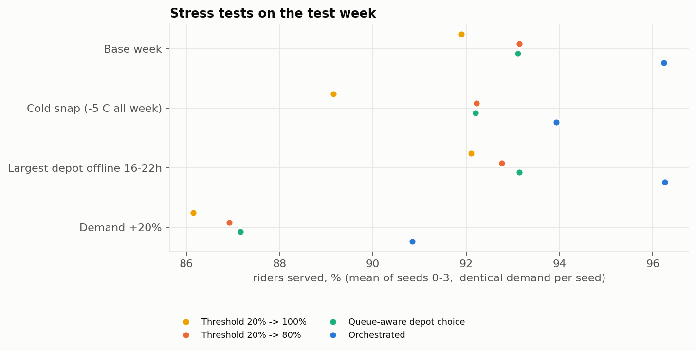</p>

**Siting.** Exact p-median (MILP, SciPy/HiGHS) weighted by where cars drop off riders, versus a common heuristic:

<p align="center">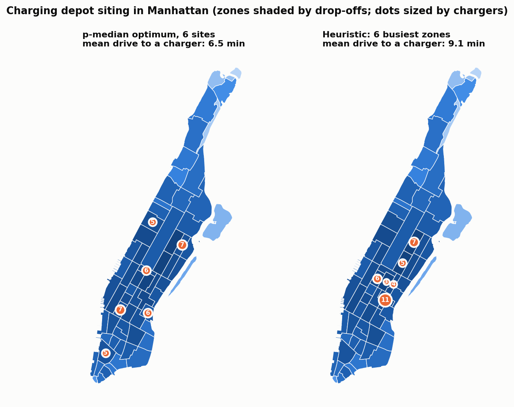</p>

| Layout (36 chargers) | Mean drive to a charger | Charger-trip km per car-day | Riders served (queue-aware) |
|---|---:|---:|---:|
| 1 site (1-median) | 12.9 min | 4.5 | 93.3 % |
| 3 sites, p-median | 8.1 min | 3.3 | 93.2 % |
| 6 busiest drop-off zones | 9.1 min | 3.3 | 93.3 % |
| **6 sites, p-median** | **6.5 min** | **2.5** | 93.1 % |
| 12 sites, p-median | 5.6 min | 2.1 | 92.8 % |

Siting mostly changes how far cars drive empty to charge (energy, wear, emissions), not whether riders get served: service differs by less than 0.5 pp across layouts (4 seeds each). Twelve small sites serve slightly fewer riders, consistent with — but not proof of — weaker queue pooling at small sites.

---

## Session study: 259k charging sessions in Palo Alto

<p align="center">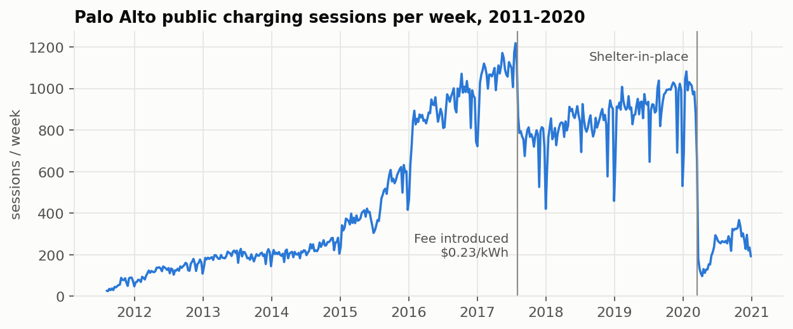</p>

### Predicting, at plug-in, how long a car will stay

Features are computed **as of plug-in time** in SQL window functions: the driver's history uses only sessions that had *ended* before this one started (a future-intervention test enforces this), plus site occupancy, calendar and weather. The session's own fee is excluded because it is billed per kWh and would leak the energy target. Splits are chronological: train 2011–2018, calibrate Jan–Jun 2019, test Jul–Dec 2019, and 2020 as a shift test.

<p align="center">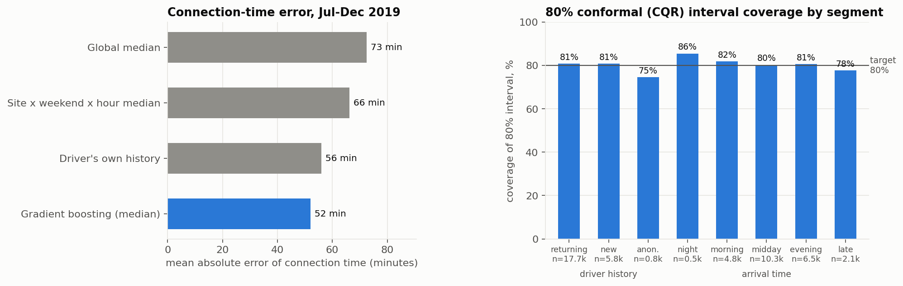</p>

| Held-out Jul–Dec 2019 (24k sessions) | Connection time MAE | Energy MAE |
|---|---:|---:|
| Global median | 73 min | 5.4 kWh |
| Site × weekend × hour median | 66 min | 5.2 kWh |
| Driver's own history | 56 min | 4.0 kWh |
| **Gradient-boosted quantile regression** | **52 min** | **3.6 kWh** |

80 % intervals: raw quantile regression covers 78.5 %; after conformal calibration (CQR) **80.6 %** for connection time and 79.5 % for energy. Coverage is close to target across sites and times of day, but lower for **anonymous drivers (74.6 %)** — conformal guarantees are marginal, not per group, so they are measured per group.

<p align="center">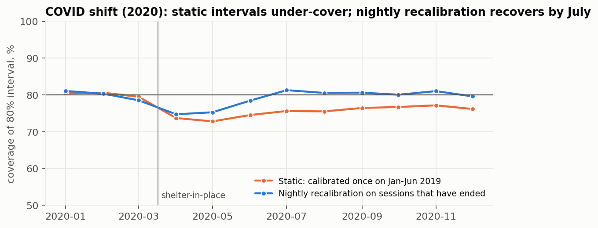</p>

### What a $0.23/kWh price did

Every station switched from free to paid on **1 August 2017**, so there is no untreated control station. Three designs are reported side by side: an interrupted time series with separate trends, weather and calendar controls and Newey–West standard errors; a year-over-year difference-in-differences against 2016; and the **same year-over-year design as a placebo** with a fake fee in August 2016.

<p align="center">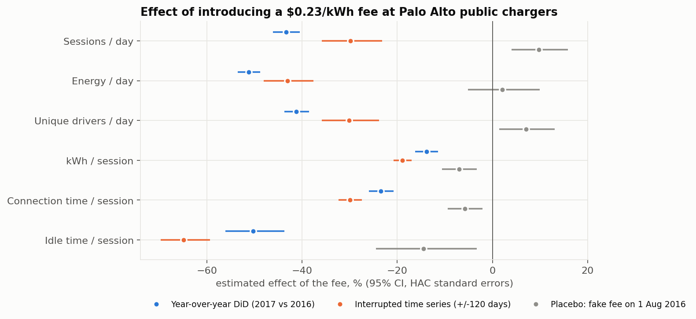</p>

<p align="center">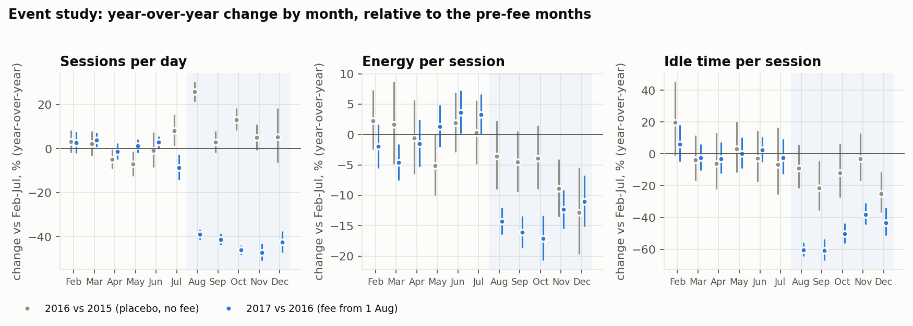</p>

| Outcome | Time series (±120 days) | Year-over-year DiD | Placebo (2016) |
|---|---:|---:|---:|
| Sessions per day | −30 % | −43 % | +10 % |
| Energy per day | −43 % | −51 % | +2 % |
| Unique drivers per day | −30 % | −41 % | +7 % |
| kWh per session | −19 % | −14 % | −7 % |
| Connection time per session | −30 % | −23 % | −6 % |
| **Idle time per session** | **−65 %** | **−50 %** | −15 % |

The price was per kWh, yet idle time fell the most. Segmenting sessions explains why: the fee mostly removed people using chargers as parking.

<p align="center">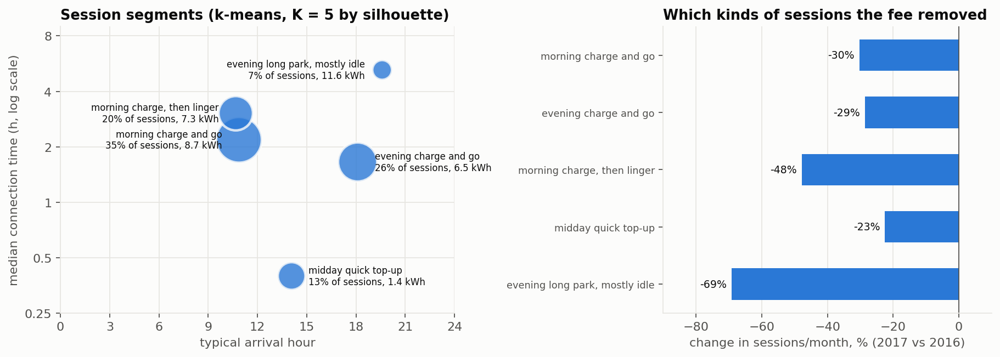</p>

Segments are k-means clusters on arrival time, connection time, energy and idle time; K = 5 maximises the silhouette score (0.29 — the segments are soft, not sharply separated) and is stable across seeds (adjusted Rand index 0.997).

**What did not work:** a driver-cohort decomposition (did existing drivers leave, or charge less?) fails its own placebo — the 2016 "effect" on stayers' frequency (−20 %) is as large as the 2017 one (−18 %) — so it is reported in the results files but not interpreted. Retention of existing drivers did not change detectably (−2.4 pp, CI −4.9 to +0.2).

### Where drivers find no free port

<p align="center">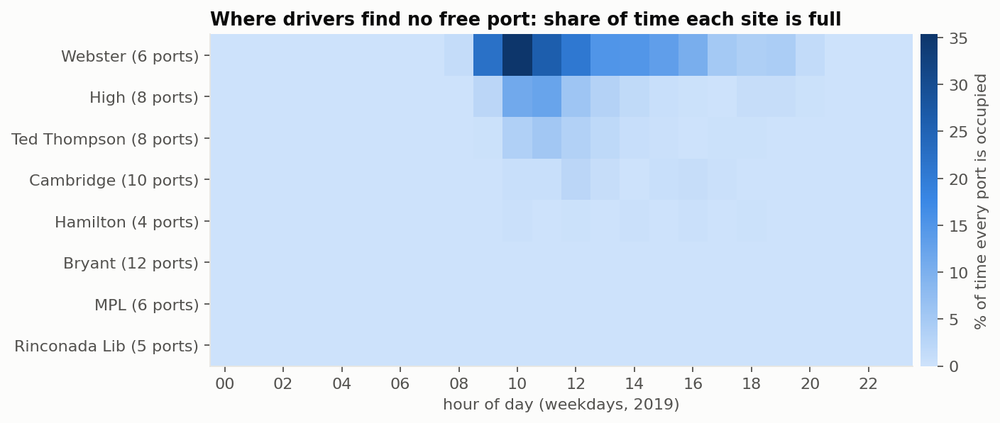</p>

Drivers turned away by a full site never appear in the data, so the share of time a site is full is a lower bound on unmet demand and the first input to a "where do we add ports" decision.

---

## Engineering

- **Data pipeline:** `python -m evfleet.data.download` fetches every source, records URL, size, SHA-256 and time in a manifest, and never overwrites raw files. Cleaning is SQL ([`sql/`](sql)) run by DuckDB over Parquet; every raw row gets exactly one outcome, so exclusions are fully accounted for (99.96 % of Palo Alto rows kept; NYC exclusions are itemised in [`reports/results/nyc_trips_data_quality.csv`](reports/results/nyc_trips_data_quality.csv)).
- **Simulator correctness** ([`tests/test_sim.py`](tests/test_sim.py)): energy conservation to 1e-6 kWh, no stranded vehicles, request accounting, waits within patience, charger capacity never exceeded, determinism, identical demand across policies, outage behaviour and time accounting. Across all **314 experiment runs: 0 stranded vehicles, largest energy-ledger residual 3e-6 kWh.** These checks caught real bugs during development — idle drain on parked cars that was never re-checked, a depot choice that could exceed a car's remaining range, and time lost in end-of-run accounting — all fixed before the reported experiments.
- **Statistics:** exact finite-sample conformal quantile (returns an unbounded interval when calibration data are too few), Newey–West HAC standard errors, paired seeds with t-intervals, placebo tests; all unit-tested.
- **Optimization:** p-median MILP verified against brute force; Hungarian assignment for charger slots and rebalancing.
- 54 tests; lint and tests run in GitHub Actions on Python 3.11 and 3.12 using synthetic fixtures (no data download needed).

## Limitations

The full list is in [`docs/methodology.md`](docs/methodology.md). The most important:

- Taxi trips are **served** demand, not latent demand; airports are excluded from the service area (airport pickups need separate staging logic).
- Travel times are exogenous (from taxi data); the fleet does not create congestion, and there is no road-level routing or ride pooling.
- Vehicle energy and charging curves are **representative assumptions**, not telemetry; cold-weather results depend on the HVAC assumption.
- Energy cost uses wholesale day-ahead prices only; demand charges are why peak load is reported separately.
- Results describe one real week of demand under many replicas; they are not a claim about every city, season or fleet.
- The fee study measures demand at *these* public stations; drivers may have moved to chargers the data cannot see.

## Reproduce

```bash
git clone https://github.com/tanaymihani/ev-fleet-charging-lab && cd ev-fleet-charging-lab
make setup        # virtual environment + package (Python >= 3.11)
make data         # ~160 MB of public data, hashed manifest, processed tables
make sessions     # Palo Alto study + fleet input validation (~3 min)
make fleet        # 266 fleet runs (~10 min on 6 cores)
.venv/bin/python scripts/run_fleet_ablation.py
.venv/bin/python scripts/run_fleet_profiles.py
make figures
.venv/bin/python scripts/summarize_results.py   # reports/results/headline_numbers.csv
make test
```

## Layout

```
src/evfleet/
  data/        download + manifest, Palo Alto and TLC builders, NYISO prices, weather
  sessions/    plug-in-time models, conformal intervals, segmentation, fee analysis, congestion
  forecast/    short-horizon demand forecaster
  optimize/    p-median siting (MILP)
  sim/         network (travel times), energy, charging curve, event-driven engine, policies, experiments
sql/           cleaning and feature SQL (DuckDB)
scripts/       one script per study; each writes to reports/results
reports/       results (CSV) and figures (PNG)
tests/         unit and invariant tests (synthetic data)
docs/          methodology, assumptions and limitations
```

## Data sources

| Source | Licence / terms |
|---|---|
| [City of Palo Alto — EV Charging Station Usage, Jul 2011–Dec 2020](https://data.paloalto.gov/datasets/194693/electric-vehicle-charging-station-usage-july-2011-dec-2020/) | Open Data Commons PDDL |
| [NYC TLC Trip Record Data](https://www.nyc.gov/site/tlc/about/tlc-trip-record-data.page) (yellow taxi, April 2025) and taxi-zone shapefile | NYC Open Data terms of use |
| [NYISO](https://www.nyiso.com/energy-market-operational-data) day-ahead zonal LBMP, April 2025 | NYISO public market data |
| [Open-Meteo](https://open-meteo.com/) historical weather API | CC BY 4.0 |

Raw data are downloaded by script and not redistributed here.

## License

Code: MIT — see [LICENSE](LICENSE).
